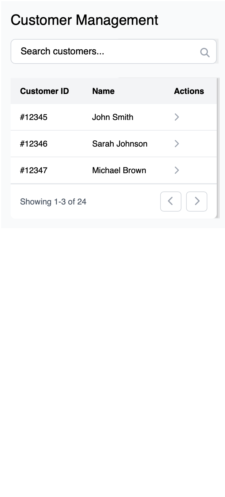

# Session 04 / Sales mobile

In this session, you must implement a mobile application for the bank. The application should be able to show all customers and their details. The user should be able to search for customers and view their details. The user should also be able to initiate a customer rating report using the `crs` (Customer Rating Service) and send it to the customer using the `ns` (Notification Service).

## Customers

On startup of the application, the user should be able to see all customers in a paginated table. The user should be able to search in the customers using a single text field. 

The search function should be able to search in the firstname, lastname, birthplace and email (using `OR`). In case the user specifies multiple words, it should be considered as an `AND` function.



## Customer details

When the user clicks on a customer, the user should be redirected to a detail page. The detail page should show all information about the customer. Such as contracts, accounts and their details.


## Customer rating

The user should be able to initiate a customer rating report using the `crs` (Customer Rating Service). The `crs` is a central system used by the bank to check customer ratings as well as load information from the government about the individual.

The `crs` can be used the following way:

GET crs/ratings/{customerId}

```json
{
  "bankRating": {
    "balanceRating": "Good",
    "transactionRating": "Excellent",
    "hasNegativeBalanceInHistory": true
  },
  "governmentInfo": {
    "hasCriminalRecord": false,
    "isSanctioned": false,
    "hasBankruptcy": false,
    "hasDebtCollection": false
  }
}
```

The user should be able to properly view the `crs` report, the user should be able to back out of this view, or send it to the customer using the `ns` (Notification Service). The `ns` can be used the following way:


POST ns/send

```json
{
  "customerId": "123e4567-e89b-12d3-a456-426614174000",
  "template": "customer-rating-good-report"
}
```

There are three types of general rating reports:

#### **customer-rating-bad-report**

```text
In case the bank rating is bad on any front, or there is a negative balance in history, or the government info has more than 2 negative information about the customer. In case the user has debt collection then the rating must also be bad, no matter what.
```

#### **customer-rating-good-report**

```text
In case the bank rating is at least good on all fronts and there is no negative balance in history, also the government info has at most 1 negative information about the customer.
```

#### **customer-rating-excellent-report**

```text
In case the bank rating is excellent on all fronts and there is no negative balance in history, also the government info doesn't have any negative information about the customer.
```

## ✅ Submission Instructions

- Submit your solution via **Git repository**
- Include:
  - Complete **source code**
  - A `README.md` with clear instructions on:
    - How to **start** the application
    - Where to configure **API URLs**
    - How to run it locally (dependencies, build steps, etc.)
